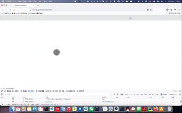
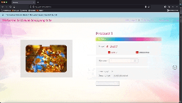

# COMP3019J Assignment

### Project Name: Grocery List Website

### Team_20 Members:

* Wang Yuyang 19206226
* Yang Liuxin 19206207

### Project Description
The website should allow multiple grocery shops to set up products available, along with their unit prices as well as images. 
The website should allow users to visit different shops, and put items into their baskets. The website should allow users to view their basket at all times, and add/remove items from the basket. 
The website should allow users to increase/ decrease the quantity of the items while looking at their baskets. 
It should also calculate the total expenditure/cost for all items in the basket. 
Finally, it should create an itemized list of the user’s shopping bill, grouped by the shop.

### Preview this project (Deployed in Heroku)

This is a **preview version** of this project, it might contain errors or outdated pages.
Please use python to run this project locally to see the latest website.

[http://comp3019j-web-dev.herokuapp.com/](http://comp3019j-web-dev.herokuapp.com/)


### Run this project


#### Set up environment
1. Install Python3.9
2. Using the following code to set up the environment
```shell
python -V  # Print out python version for debugging
pip install virtualenv
virtualenv venv
source venv/bin/activate
pip install -r requirements.txt
```

#### Run this web sever

```shell
flask run
```
or

```shell
python run.py
```

or

If pipeline passed then this docker contains the same code with master:


```shell
docker pull echo0821/web-project:latest 
docker run -p 5000:5000 echo0821/web-project:latest
```
#### Open the web page using Firefox / Chrome / Edge
**Safari and IE is not offfically supported**

URL: http://localhost:5000

or

URL: http://127.0.0.1:5000

### Characteristic
* **Responsive Layout** using the flex layout
* Allow **unregistered user** to **view products**
* Auto **redirect** to login page
* **CSRF Protection**
* **Blueprint** for routing
* Passwords are **hashed**


### Intended Functionalities
#### Seller / Shop
- [x] Allow sellers to **visit** different shops
- [x] Allow sellers to set up their **personal information**
- [x] Allow multiple sellers/shops to **upload** products with their prices and images
- [x] Allow sellers to **visit** different shops
- [x] Allow sellers to **manage** their **items**
- [x] Allow sellers to **manage** their **orders**
- [ ] Expand the express delivery services
- [ ] Handle buyers' comments

#### Buyer
#### Unregistered Buyer (visitor)
- [x] Allow visitors to **visit** different shops
 #### Logged-in Buyer
- [x] Allow buyers to **visit** different shops
- [x] Allow buyers to set up their **personal information**
- [x] Allow buyers to **put** items into their **basket**
- [x] Allow buyers to **view** their **basket** at all times
- [x] Allow buyers to **add** or **remove** items form the **basket**
- [x] Allow buyers to **increase** or **decrease** the **quantity** of the items while looking at their **baskets**
- [x] Allow buyers to view the **total expenditure** for all items in the basket
- [x] Allow buyers to view an itemized list of their **shopping bill**, grouped by the shop
- [ ] Display recommended items to logged-in users based on their preferences (algorithm optimization)

### Implemented Functions for MileStone 1
#### General Functions:
- [x] Establish all basic databases
- [x] Identity Detection: detect sellers or buyers from the database
#### Not Logged-in Buyer
- [x] Allow visitors to view recommended items on the main page
- [x] Allow visitors to view at most **four** sample items of each shop on the main page
- [x] Allow visitors to click an item to view its product details and its **total sold number**
- [x] Allow visitors to click the shop to view all items in this shop
- [x] Allow visitors to view the **contact page**
- [x] Allow visitors to register for an account or log in using a valid account
- [x] Allow visitors to **search** items based on keywords

#### Logged-in Buyer
- [x] Allow buyers to view recommended items on the main page
- [x] Allow buyers to view at most **three** sample items of each shop on the main page
- [x] Allow buyers to click an item to view its **product details** and its **total sold number**
- [x] Allow buyers to **add** the currently-viewing product to their **shopping carts**
- [x] Allow buyers to **view** their **shopping carts ordered by shops**
- [x] Allow buyers to **remove** items from the **shopping cart**
- [x] Allow buyers to **increase or decrease** the **quantity** of the item in its product-details page (before adding to their baskets)
- [x] Allow buyers to **increase or decrease** the **quantity** of each item in the **shopping cart** 
- [x] Allow buyers to **make orders** and checkout orders (ordered by shops) where they will also view the **total price** of this order
- [x] Allow buyers to **manage orders** by confirming it 'Delivered'
- [x] Allow buyers to view the **sidebar**, which contains its basic profile and announcements  
- [x] Allow buyers to **upload** and **modify** their **personal details**, which contain their avatar, username, email address
- [x] Allow buyers to click the shop to view all items in this shop
- [x] Allow buyers to view the **contact page**
- [x] Allow buyers to **set up their personal information** (containing username, avatar and email address)
- [x] Allow buyers to logout the current account
- [x] Allow buyers to **search** items based on keywords

#### Sellers
- [x] Allow sellers to **add** items to their shops (containing the name, image, price, inventory and description of the newly-added item)
- [x] Allow sellers to **modify** items in their shops (modifying the name, image, price, inventory and description of the newly-updated item)
- [x] Allow sellers to **remove** items from their shops
- [x] Allow sellers to **view orders** made in their shops ordered by order-id (containing its created time)
- [x] Allow sellers to **manage order**s by confirming them
- [x] Allow sellers to visit different shops
- [x] Allow sellers to click an item to view its product details and its **total sold number**
- [x] Allow sellers to **set up their personal information** (containing username, avatar and email address)
- [x] Allow sellers to view the **contact page**
- [x] Allow sellers to logout the current account
- [x] Allow sellers to **search** items based on keywords

### To-Do List for MileStone 2
* Navigation bar
  * Optimize the navigation bar to better display contents
    * Allow the user's avatar to be displayed in the navigation bar
* Index Page
  * Improve the **sidebar**
    * Displayed the order status in the sidebar
    * Display recommended products based on users' preferences in the sidebar
  * Optimize Page Layout
    * Add right and left sidebars for information display
  * Optimize Algorithm
    * Display **recommended products by users' preferences** (by calculating the word distance between the user's ordered products' titles and the products' titles on sale)
* Shopping Cart (basket)
  * Use **JS** to calculate the total price
  * Use **AJAX** to dynamically change the number of a product in the shopping cart
* Ordering
  * Expand the functionality of **refunds** and **order canceling**
  * Expand the functionality of sellers **uploading the delivery express ID**
  * Expand the functionality of buyers **commenting an order or item** when confirming delivering
  * Alert the user when they try to "Confirm Delivered" the order that is not confirmed by the shopper
* User profile
  * Expand the functionality of **restoring the password** using email 
* Product details
  * Expand the functionality of sellers setting up the introduction in the product details page
  * Expand the **iframe** to the product detail page


### User Accounts for Testing

Seller:
* Username: shop1
* Password: 123

Buyer:
* Username: buyer1
* Password: 123

### Roles in the system
1. **Buyers**
   1. Register and Login on the login-register page
   2. Can add products to his shopping cart
   3. Can view his cart
   4. Can make orders 
   5. Can view his orders
   6. Cannot add products to the shopping site
   7. Cannot manage products of the site
2. **Seller** (**registered by Admin in the database, not allowed to be created by public register**)
   1. Can add products to the shopping site
   2. Can manage products 
   3. Can view and manage orders made from his shop
   4. Can confirm orders
   5. **Cannot view his cart**
   6. Cannot make orders
   
### Buyer's Functionality
* Navigation bar
  * Automatically change for different roles
  * Auto-hide & display flash message
* Index Page
  * Allowing buyers to view recommended products
  * Allowing buyers to view sample products grouped by shops
* Shopping Cart
  * Buyers can add a product to their shopping cart
  * Items in the cart can be removed or added in quantity
  * Items can be correctly counted if buyers add the product multiple times from the product-details page
* Ordering
  * Buyers can make orders from his shopping cart
  * After paying, users can view the order on the order page
* User profile
  * User can change their avatar on the profile page
  * User can change their email on the profile page
  * User can change their password on the profile page

### Seller's Functionality
* Navigation bar
  * Automatically Change for different roles
  * Auto-hide & display flash message
* Index Page
  * Allowing sellers to view recommended products
  * Allowing sellers to view sample products grouped by shops
* Product Management
  * Sellers can add a product to the system
  * Sellers can modify products of the system
  * Sellers can remove products from the system
* Order Management
  * User can view the orders made in his shop 

### Team 20 small video

The following Weiyun file consists of both members where we explain what grade we think we deserve based on assessment criteria: https://share.weiyun.com/fGgz0sD2

### Misc

* Loading animation for users in poor network condition



* Adaptive image size and adaptive layout



